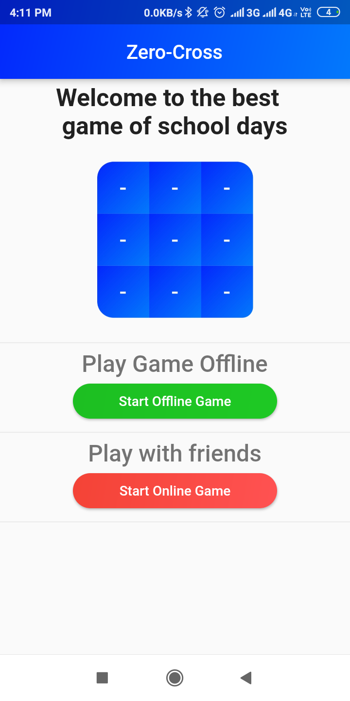
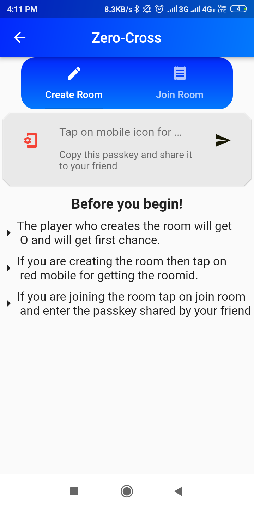
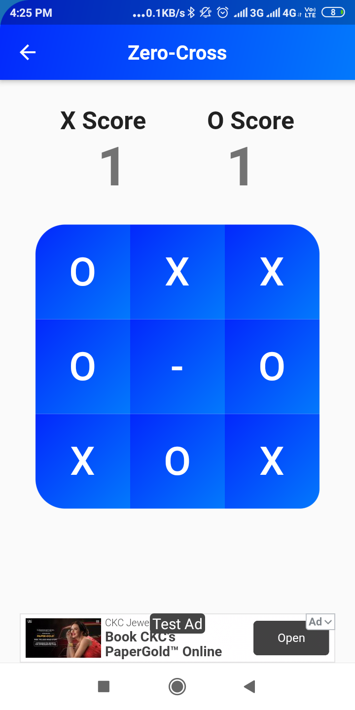

# zero_cross
This is the same old school tic tac toe added with the magic of real-time database which allows user to play this game with theirs friends online while both of them are sitting at their respective homes.

 <h3>Frontend</h3>
 &nbsp&nbspFlutter Framework with dart.
 <h3>Backend</h3>
    &nbsp&nbspCloud firestore/ Firebase.
    
   # UI Design   
  
  <h3>main.dart</h3>
   
   
  <h3>Online Game Page</h3> 
 

 <h3>Game Board</h3> 
 
 
